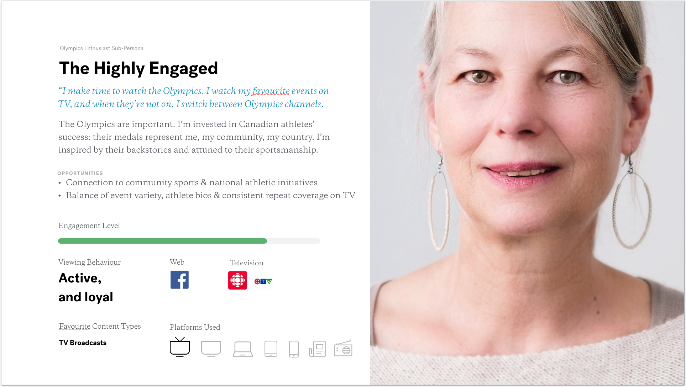

# Personas

### What is a Persona?

Simply put, a persona is nothing more than a detailed description of the person that you are designing for. 



Personas are a useful communication tool that can be leveraged for a number of things, such as:

* Visually communicating your research findings in a easily digestible manner
* Creating empathy and continuously advocating for users needs
* Breaking up an amorphous user base into manageable, well defined, targets


Personas are not the same as your [Target Market](https://en.wikipedia.org/wiki/Target_market). A target market represents a segment of your buyers based on demographic data. This segment is the primary focus of a business's marketing efforts. Conversely, a persona is focused more on behaviour patterns than demographic ones. 


### How to use Personas

Your exploratory interviews will invariably generate a range of real life scenarios, preferences and behaviour patterns from real people. To create personas, you'll need to merge individuals with similar patterns. Created mindfully, your personas will embody clusters of real people with analogous behaviours and needs. Your team will then need to align on which personas represent a reasonable target for your design objectives. Making this choice will act as a critical point of conversion for your team. Going forward, the behavioural patterns of the personas you choose to focus on should serve as a continuous reference point for future design decisions.


Your personas do not have to be in your [Target Market](https://en.wikipedia.org/wiki/Target_market) to be valuable in your design process. Designing for a persona outside of your primary marketing target can expose you to a broader set of needs and pain points that, once addressed, can have a net positive effect on the overall User Experience. 


### How not to use Personas

The objective of crafting a persona isn’t to create an archetype that embodies your entire customer base. Nor is it to bring the average customer to life by averaging statistically valid sample data. Rather, personas are meant to create focus for your team and to expose them to real life motivations and behaviours. 

### TWG Play


[Crafting a Design Persona](https://twg-x-uxr.gitbook.io/plays/making-a-persona) : use this play to create effective, well research-based


#### Sources

```text
Jenson, S. (2002). The simplicity shift: Innovative design tactics in a corporate world. Cambridge, UK: Cambridge University Press.
Hall, E., & Zeldman, J. (2013). Just enough research. New York: A Book Apart.
Sharon, T., & Gadbaw, B. (2016). Validating Product Ideas: Through Lean User Research. Brooklyn, NY: Rosenfeld Media.
```


